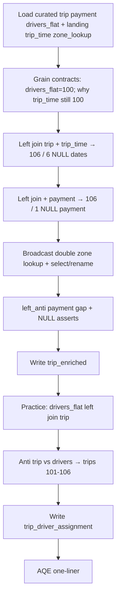

# Module 7 — Notebook 07: Build Unified Curated Tables (revised)

Authoring design / cell map. Status: pending author lock before `/new-lesson`.

## Review absorbed (author challenges → plan changes)

| # | Challenge | Plan change |
|---|---|---|
| 1 | State `drivers_flat` = **100** | Grain table, load prints, and practice predictions all use **100** |
| 2 | Composite grain untestable here | Conceptual claim + one sentence: here 1 driver per trip; production can be M:1 |
| 3 | Why landing `trip_time` is still 100 | Cell 2 one-liner: Module 6 extended trip/payment via `bad_*`, not `trip_time` — that is why 6 NULL dates exist |
| 4 | Payment has 10 cols; plan drops 2 silently | Payment select is an intentional subset; comment: aggregation enrichments (`charge_before_tip`, `tip_percent_of_base`) serve Module 8 |
| 5 | Trim validation | Primary check = `left_anti` only; `subtract` as one-line comment alternative; keep time/zone NULL asserts; one validation py cell |
| 6 | Practice validation must reveal something | Flip: `trip.left_anti(drivers_flat)` → trips **101–106** (6 rows) |
| Minor | Wrong Module 6 extras named | Drop `service_label` / bands reference; persisted payment extras are `charge_before_tip` / `tip_percent_of_base` |
| Minor | Split Setup profiles | Cell 4 split → **20 cells** |

**Data verdict (confirmed):** no new data needed.

| Input | Source | Rows |
|---|---|---:|
| `curated/trip/` | Module 6 NB03 | 106 |
| `curated/payment/` | Module 6 NB03 | 105 |
| `curated/drivers_flat/` | Module 6 NB02 | **100** (12 drivers, 100 assignments; trips 1–100) |
| Landing `trip_time` | Original Parquet | 100 |
| Landing `zone_lookup` | Original JSON | 22 |

---

## Decisions locked

- **Practice shape:** Demo `trip_enriched` end-to-end (including write). Practice = build and write `trip_driver_assignment` with TODOs.
- **Apply, don’t re-teach:** Join syntax, key profiling depth, anti/semi theory, set-op theory, and broadcast threshold demos stay in **01–06** / **03**.
- **AQE:** One markdown sentence only.
- **Writes:** `DROP TABLE IF EXISTS` then `saveAsTable(..., mode="overwrite")` into `rideshare_dev.processed.*`.
- **No Volume Parquet writes.** No Spark SQL dual-API beyond `DROP` / optional read-back.
- **Out of this notebook:** Module 5 **99** Level 2 `DROP` for these two tables — separate follow-up.

## End-to-end flow

## Output contracts

| Table | Grain | Expected size | Intentional NULLs / gaps |
|---|---|---:|---|
| `rideshare_dev.processed.trip_enriched` | one row per `curated/trip.trip_id` | **106** | trips **101–106**: NULL `trip_date` / `hour_of_day`; trip **106**: NULL payment cols |
| `rideshare_dev.processed.trip_driver_assignment` | one row per (`driver_id`, `trip_id`) from `drivers_flat` | **100** | trips **101–106** have no driver (visible via practice anti from trip side) |

## Final column sets

**`trip_enriched`** (explicit `select` before write):

- Trip: `trip_id`, `service_type`, `pickup_location_id`, `dropoff_location_id`, `trip_distance_miles`, `ride_duration_mins`
- Time: `trip_date`, `hour_of_day`
- Payment (intentional subset of curated’s 10 cols): `payment_method`, `base_fare_amount`, `tip_amount`, `driver_payout_amount` — omit `charge_before_tip` / `tip_percent_of_base` (Module 8 aggregations)
- Zones: `pickup_borough`, `pickup_zone`, `dropoff_borough`, `dropoff_zone`

**`trip_driver_assignment`:**

- From `drivers_flat`: `driver_id`, `driver_name`, `license_number`, `vehicle_make`, `vehicle_model`, `vehicle_year`, `vehicle_body_type`, `trip_id`
- From `curated/trip`: `service_type`, `trip_distance_miles`, `pickup_location_id`, `dropoff_location_id`

## Topics → sections

| Section | Topic | Skill reused from |
|---|---|---|
| Setup | Load inputs; grain contracts; split profiles | **02** (apply) |
| 1 | Stepwise left joins: time then payment + NULL metrics | **01**; README Expected NULLs |
| 2 | Zone double lookup + `F.broadcast` + cleanup `select` | **03** (no threshold=-1) |
| 3 | Validate: `left_anti` + NULL asserts (`subtract` comment only) | **04** / **06** |
| 4 | Write `trip_enriched` | Module 5 `saveAsTable` |
| Practice | Build + anti-reveal 101–106 + write `trip_driver_assignment` | same habit, different grain |
| Close | AQE note + summary | README “AQE note only” |

## Avoid list

- Re-teaching inner/left/right/full, Boolean vs string forms, M:M, `eqNullSafe`, multiset set ops, union column-order trap
- Auto-broadcast threshold `-1` dance from **03**
- Running both `left_anti` and `subtract` as peer checks on `trip_enriched`
- Aggregations / windows / `groupBy` pedagogy
- Delta ACID / `MERGE` / time travel
- Claiming composite grain is empirically proven on this data

---

## Cell-by-cell map (20 cells)

| # | Type | DBTITLE | Content |
|---|---|---|---|
| 1 | md | Introduction | Problem: Modules 8–9 need two managed tables. TOC: Setup → stepwise enrich → zones → validate → write → practice (driver assignment) → AQE. **Reads:** curated `trip`/`payment`/`drivers_flat`; landing `trip_time`, `zone_lookup`. **Prerequisites:** Module 7 **01–06**; Module 6 curated. **Writes:** both UC tables. |
| 2 | md | Setup — grain contracts | Input table with **exact rows**: trip 106, payment 105, **drivers_flat 100**, trip_time 100, zone_lookup 22. Target grains for both outputs. Expected NULLs (101–106 time; 106 payment). **Asymmetry sentence:** Module 6 extended trip/payment via `bad_*` files but never extended `trip_time` (still original landing 100) — that is why left-joining curated trip to landing `trip_time` yields 6 NULL dates. Habit: profile → predict → run → verify after each join. |
| 3 | py | Setup — load inputs | `F` import; paths; load curated trip/payment/drivers_flat (parquet), landing `trip_time` (parquet), `zone_lookup` (JSON + DDL as **03**). Print counts: **106 / 105 / 100 / 100 / 22**. |
| 4 | py | Setup — profile trip, payment, trip_time | rows / `countDistinct(trip_id)` / nulls on key. Confirm trip and payment unique on `trip_id`; trip_time 100 unique. |
| 5 | py | Setup — profile drivers_flat | Print rows = **100**, `countDistinct("trip_id")` = 100. **Conceptual note (print or short comment):** grain is (`driver_id`, `trip_id`); on this dataset each trip has exactly one driver, so distinct trip_id equals row count — in production the same grain can be M:1 (multiple drivers/assignments per trip). Do not pretend the composite key is empirically proven distinct from trip grain here. |
| 6 | md | 1. Stepwise left joins | Predict: trip ⟕ trip_time → **106** rows, **6** NULL `trip_date`. Then ⟕ payment → **106**, **1** NULL `payment_method`. Why left (preserve curated trip grain). |
| 7 | py | 1a. trip ⟕ trip_time | Join on `trip_id`; drop duplicate key col. Count 106; NULL `trip_date` = 6; sample trips 101–106. |
| 8 | py | 1b. + payment | Left join payment; count 106; NULL `payment_method` = 1; show trip 106. Result name `trip_with_time_pay`. |
| 9 | md | 2. Zone lookup + broadcast | Apply **03**: aliases `t`/`pz`/`dz`; Boolean keys; `F.broadcast` both zone sides; immediate `select`/`alias` to `pickup_*`/`dropoff_*`. No threshold reconfiguration. Short `.explain()` OK if it stays one glance. |
| 10 | py | 2. Build trip_enriched | Double left lookup + final `select` (payment subset with one-line comment omitting Module 8 enrichments). Count 106; show 5 rows or schema. |
| 11 | md | 3. Validate before write | Apply **04**: predict `left_anti` on trip vs payment → trip **106**. Keep time NULL = 6 and zone borough NULL = 0 asserts. One sentence: key-only `subtract` is an equivalent alternative (shown in **06**) — do not run it here. |
| 12 | py | 3. Validation checks | `left_anti` payment gap; assert time NULLs = 6; assert pickup/dropoff borough NULLs = 0. Print pass/fail. Write only after green. |
| 13 | md | 4. Write trip_enriched | Managed table name; overwrite; Delta-by-default; Delta internals → Module 10. `DROP` then `saveAsTable`. |
| 14 | py | 4. Write + read-back | Drop; write `rideshare_dev.processed.trip_enriched`; read-back count 106. |
| 15 | md | Practice — trip_driver_assignment | Grain: one row per (`driver_id`, `trip_id`) from `drivers_flat` (**100**). Left join to `curated/trip` (not `trip_enriched`). Predict: assignment rows = **100**. **Reveal check:** `trip.left_anti(drivers_flat)` on `trip_id` → **6** rows (trips **101–106**). Prediction table for learner. |
| 16 | py | Practice TODO — build | TODO: `drivers_flat` ⟕ `trip` on `trip_id`; select driver cols + trip attributes; name `trip_driver_assignment`. |
| 17 | py | Practice TODO — validate | TODO: count = 100; **`trip.left_anti(drivers_flat)` → 6** (show 101–106). Optional: assignment-side anti vs trip = 0 (sanity). |
| 18 | py | Practice TODO — write | TODO: `DROP` + `saveAsTable` `rideshare_dev.processed.trip_driver_assignment`; read-back count 100. |
| 19 | md | AQE note | ≤3 sentences: runtime may adapt join strategy (AQE); explicit hint here is `F.broadcast`; deeper tuning → Module 16. |
| 20 | md | Summary | Grain first; stepwise left joins + NULL metrics; reuse lookup/broadcast; validate with anti (+ NULL asserts); write after validation; two managed tables for Modules 8–9. **Next:** Module 8. |

---

## Authoring guardrails

- Voice/structure match siblings: intro TOC, Setup, numbered sections, practice TODOs, summary, next pointer.
- Paths only from `docs/data/dataset-overview.md` / module README.
- `# noqa: F821` on Databricks-provided names as needed.
- Practice validation must surface trips **101–106**, not only “zero orphans.”
- Do not update `COURSE_MODULES.md` or `docs/validation/` from authoring commands.

## Suggested authoring sequence (after you lock this map)

1. `/new-lesson` → `07 - Build Unified Curated Tables.py`
2. `/write-lesson` fill per 20-cell map
3. `/validate-notebook`
4. Author runtime validation in Azure Databricks
5. Separate follow-up: Module 5 **99** Level 2 `DROP TABLE IF EXISTS` for both Module 7 tables
