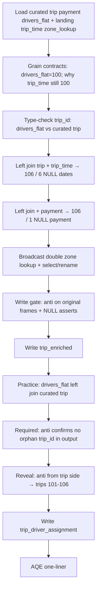

# Module 7 — Notebook 07: Build Unified Curated Tables (locked)

Authoring design / cell map. Status: LOCKED — pending `/new-lesson`.

## Round 1 review absorbed

| # | Challenge | Plan change |
|---|---|---|
| 1 | State `drivers_flat` = **100** | Grain table, load prints, and practice predictions all use **100** |
| 2 | Composite grain untestable here | Conceptual claim + one sentence: here 1 driver per trip; production can be M:1 |
| 3 | Why landing `trip_time` is still 100 | Cell 2 one-liner: Module 6 extended trip/payment via `bad_*`, not `trip_time` — that is why 6 NULL dates exist |
| 4 | Payment has 10 cols; plan drops 2 silently | Payment select is an intentional subset — see Round 2 #2 for the final rule wording |
| 5 | Trim validation | Primary check = `left_anti` only; `subtract` as one-line comment alternative; keep time/zone NULL asserts |
| 6 | Practice validation must reveal something | Flip: `trip.left_anti(drivers_flat)` → trips **101–106** (6 rows) |
| Minor | Wrong Module 6 extras named | Persisted payment extras are `charge_before_tip` / `tip_percent_of_base` (not `service_label`/bands) |
| Minor | Split Setup profiles | Cell 4 split → **20 cells** |

## Round 2 review absorbed

| # | Challenge | Plan change |
|---|---|---|
| 1 | Prereqs too generic ("Module 6 curated") | Cell 1: name **Module 6 `02` and `03`** explicitly (the two notebooks that write curated outputs), while keeping "complete Module 6" as the overall bar |
| 2 | Payment-subset justification named wrong owner ("Module 8 aggregations") and only covered 2 of 6 omitted columns | One rule, covering all omissions: **"Core payment facts only (`payment_method`, `base_fare_amount`, `tip_amount`, `driver_payout_amount`). Full breakdown and Module 6 derived metrics remain in `curated/payment/`."** |
| 3 | Cell 12's `left_anti` frame pairing was unstated; risk of reading it as re-proving the enriched frame | State explicitly: anti runs on the **original curated `trip`/`payment` frames**, framed as a **write gate** (re-confirming a known gap), not a new discovery — the NULL asserts on `trip_enriched` are what validate the output shape |
| 4 | `trip_id` type alignment (`drivers_flat` XML-inferred vs `curated/trip` explicit `bigint`) was unverified — checked the actual code: Module 6 Notebook 02 has no explicit schema/cast on `trip_id`, so this is inference-dependent, not guaranteed | Add a one-line `.dataType` print in cell 5 (zero complexity cost, catches a silent zero-row join before it ships) |
| 6 | "Why join `curated/trip`, not `trip_enriched`, for the practice" lacked a learner-observable reason | Add sentence: joining `trip_enriched` would drag `trip_date`, `hour_of_day`, `payment_method`, zone columns — and their NULLs — into a table where those columns have no business meaning (a different grain) |
| — | Cell 17's assignment-side anti was labeled "optional," ambiguous for a TODO | Remove "optional." Make it a required step: it validates the learner's **output** (no orphan `trip_id`), distinct from the reveal check which validates the **input** gap (trips 101–106) |
| — | README doesn't yet state the lean-subset philosophy | Add one sentence on **both** output rows (`trip_enriched` and `trip_driver_assignment`) in the Module 7 README output-contract table |

**Data verdict (confirmed):** no new data needed.

| Input | Source | Rows |
|---|---|---:|
| `curated/trip/` | Module 6 **`03`** | 106 |
| `curated/payment/` | Module 6 **`03`** | 105 |
| `curated/drivers_flat/` | Module 6 **`02`** | **100** (12 drivers, 100 assignments; trips 1–100) |
| Landing `trip_time` | Original Parquet | 100 |
| Landing `zone_lookup` | Original JSON | 22 |

---

## Decisions locked

- **Practice shape:** Demo `trip_enriched` end-to-end (including write). Practice = build and write `trip_driver_assignment` with TODOs.
- **`trip_enriched` philosophy:** a **trip-grain join view**, not a full denorm. It carries what the joins in this notebook *add* (time dims, zone dims, core payment facts) — not everything Module 6 ever computed. Full payment breakdown and Module 6 derived metrics stay in `curated/payment/`; Module 8/9 read that table directly if they need those columns.
- **Apply, don't re-teach:** Join syntax, key profiling depth, anti/semi theory, set-op theory, and broadcast threshold demos stay in **01–06** / **03**.
- **AQE:** One markdown sentence only.
- **Writes:** `DROP TABLE IF EXISTS` then `saveAsTable(..., mode="overwrite")` into `rideshare_dev.processed.*`.
- **No Volume Parquet writes.** No Spark SQL dual-API beyond `DROP` / optional read-back.
- **Out of this notebook:** Module 5 **99** Level 2 `DROP` for these two tables — separate follow-up.

## End-to-end flow

## Output contracts

| Table | Grain | Expected size | Intentional NULLs / gaps |
|---|---|---:|---|
| `rideshare_dev.processed.trip_enriched` | one row per `curated/trip.trip_id` | **106** | trips **101–106**: NULL `trip_date` / `hour_of_day`; trip **106**: NULL payment cols |
| `rideshare_dev.processed.trip_driver_assignment` | one row per (`driver_id`, `trip_id`) from `drivers_flat` | **100** | trips **101–106** have no driver (surfaced via practice reveal check) |

**README addition (do at authoring time):** one sentence on each row above stating the lean-subset philosophy, e.g. for `trip_enriched`: "Column set: trip attributes + time + core payment facts. Full payment breakdown remains in `curated/payment/`." — and the equivalent for `trip_driver_assignment` ("driver + trip attributes only, not the full enriched view").

## Final column sets

**`trip_enriched`** (explicit `select` before write):

- Trip: `trip_id`, `service_type`, `pickup_location_id`, `dropoff_location_id`, `trip_distance_miles`, `ride_duration_mins`
- Time: `trip_date`, `hour_of_day`
- Payment — **core facts only:** `payment_method`, `base_fare_amount`, `tip_amount`, `driver_payout_amount`. Full breakdown (`surge_amount`, `tax_amount`, `discount_amount`) and Module 6 derived metrics (`charge_before_tip`, `tip_percent_of_base`) remain in `curated/payment/`.
- Zones: `pickup_borough`, `pickup_zone`, `dropoff_borough`, `dropoff_zone` (omit `service_zone` — not needed downstream; note this inline during authoring)

**`trip_driver_assignment`:**

- From `drivers_flat`: `driver_id`, `driver_name`, `license_number`, `vehicle_make`, `vehicle_model`, `vehicle_year`, `vehicle_body_type`, `trip_id`
- From `curated/trip`: `service_type`, `trip_distance_miles`, `pickup_location_id`, `dropoff_location_id`

## Topics → sections

| Section | Topic | Skill reused from |
|---|---|---|
| Setup | Load inputs; grain contracts; split profiles; `trip_id` type check | **02** (apply) |
| 1 | Stepwise left joins: time then payment + NULL metrics | **01**; README Expected NULLs |
| 2 | Zone double lookup + `F.broadcast` + cleanup `select` | **03** (no threshold=-1) |
| 3 | Write gate: `left_anti` on original frames + NULL asserts | **04** / **06** |
| 4 | Write `trip_enriched` | Module 5 `saveAsTable` |
| Practice | Build + required output check + reveal (input gap) + write `trip_driver_assignment` | same habit, different grain |
| Close | AQE note + summary | README "AQE note only" |

## Avoid list

- Re-teaching inner/left/right/full, Boolean vs string forms, M:M, `eqNullSafe`, multiset set ops, union column-order trap
- Auto-broadcast threshold `-1` dance from **03**
- Running both `left_anti` and `subtract` as peer checks on `trip_enriched`
- Aggregations / windows / `groupBy` pedagogy
- Delta ACID / `MERGE` / time travel
- Claiming composite grain is empirically proven on this data
- Naming Module 8 as the owner of the omitted payment columns (they are Module 6 derived metrics; the rule is grain ownership, not "who consumes them")
- Framing the `trip_driver_assignment` join-source choice as "irrelevant columns" — the reason is NULL inheritance / wrong grain, not irrelevance

---

## Cell-by-cell map (20 cells)

| # | Type | DBTITLE | Content |
|---|---|---|---|
| 1 | md | Introduction | Problem: Modules 8–9 need two managed tables. TOC: Setup → stepwise enrich → zones → validate → write → practice (driver assignment) → AQE. **Reads:** curated `trip`/`payment`/`drivers_flat`; landing `trip_time`, `zone_lookup`. **Prerequisites:** Module 7 **01–06**; complete Module 6, with curated inputs specifically from Module 6 **`02`** (`drivers_flat`) and **`03`** (`trip`/`payment`). **Writes:** both UC tables. |
| 2 | md | Setup — grain contracts | Input table with **exact rows**: trip 106, payment 105, **drivers_flat 100**, trip_time 100, zone_lookup 22. Target grains for both outputs. Expected NULLs (101–106 time; 106 payment). **Asymmetry sentence:** Module 6 extended trip/payment via `bad_*` files but never extended `trip_time` (still original landing 100) — that is why left-joining curated trip to landing `trip_time` yields 6 NULL dates. Habit: profile → predict → run → verify after each join. |
| 3 | py | Setup — load inputs | `F` import; paths; load curated trip/payment/drivers_flat (parquet), landing `trip_time` (parquet), `zone_lookup` (JSON + DDL as **03**). Print counts: **106 / 105 / 100 / 100 / 22**. |
| 4 | py | Setup — profile trip, payment, trip_time | rows / `countDistinct(trip_id)` / nulls on key. Confirm trip and payment unique on `trip_id`; trip_time 100 unique. |
| 5 | py | Setup — profile drivers_flat + type check | Print rows = **100**, `countDistinct("trip_id")` = 100. **Conceptual note:** grain is (`driver_id`, `trip_id`); on this dataset each trip has exactly one driver, so distinct trip_id equals row count — in production the same grain can be M:1. **Type check (new):** print `drivers_flat.schema["trip_id"].dataType` alongside `curated_trip.schema["trip_id"].dataType` — confirm they match before the practice join relies on it (drivers_flat's type comes from XML inference, not an explicit cast, so this is a real check, not decoration). |
| 6 | md | 1. Stepwise left joins | Predict: trip ⟕ trip_time → **106** rows, **6** NULL `trip_date`. Then ⟕ payment → **106**, **1** NULL `payment_method`. Why left (preserve curated trip grain). |
| 7 | py | 1a. trip ⟕ trip_time | Join on `trip_id`; drop duplicate key col. Count 106; NULL `trip_date` = 6; sample trips 101–106. |
| 8 | py | 1b. + payment | Left join payment; count 106; NULL `payment_method` = 1; show trip 106. Result name `trip_with_time_pay`. |
| 9 | md | 2. Zone lookup + broadcast | Apply **03**: aliases `t`/`pz`/`dz`; Boolean keys; `F.broadcast` both zone sides; immediate `select`/`alias` to `pickup_*`/`dropoff_*`. No threshold reconfiguration. Note `service_zone` is deliberately excluded — not needed downstream. |
| 10 | py | 2. Build trip_enriched | Double left lookup + final `select`. Payment select carries a one-rule comment: **"Core payment facts only (`payment_method`, `base_fare_amount`, `tip_amount`, `driver_payout_amount`). Full breakdown and Module 6 derived metrics remain in `curated/payment/`."** Count 106; show 5 rows or schema. |
| 11 | md | 3. Validate before write | Apply **04**: predict `left_anti` between the **original curated `trip` and `payment` frames** (not `trip_enriched`) on `trip_id` → trip **106**. Frame this explicitly as a **write gate** — re-confirming a known gap — not a new discovery. Keep time NULL = 6 and zone borough NULL = 0 asserts **on `trip_enriched`** — those are what actually validate the output shape. One sentence: key-only `subtract` is an equivalent alternative (shown in **06**) — do not run it here. |
| 12 | py | 3. Validation checks | `left_anti` between original curated `trip`/`payment` (payment gap, write gate); assert time NULLs = 6 and pickup/dropoff borough NULLs = 0 on `trip_enriched`. Print pass/fail. Write only after green. |
| 13 | md | 4. Write trip_enriched | Managed table name; overwrite; Delta-by-default; Delta internals → Module 10. `DROP` then `saveAsTable`. |
| 14 | py | 4. Write + read-back | Drop; write `rideshare_dev.processed.trip_enriched`; read-back count 106. |
| 15 | md | Practice — trip_driver_assignment | Grain: one row per (`driver_id`, `trip_id`) from `drivers_flat` (**100**). Left join to `curated/trip` — **not** `trip_enriched`: joining `trip_enriched` would drag `trip_date`, `hour_of_day`, `payment_method`, and zone columns — and their NULLs — into a table where those columns have no business meaning (a different grain). Predict: assignment rows = **100**. Two distinct checks, labeled separately: (a) **validate your output** — count = 100, no orphan `trip_id`; (b) **explore** — which trips in the full curated set have no driver assignment (`trip.left_anti(drivers_flat)` → **6** rows, trips **101–106**). |
| 16 | py | Practice TODO — build | TODO: `drivers_flat` ⟕ `trip` on `trip_id`; select driver cols + trip attributes; name `trip_driver_assignment`. |
| 17 | py | Practice TODO — validate | TODO, both required (not optional): (a) count = **100**; `drivers_flat.left_anti(trip)` on `trip_id` → **0** — confirms no orphan `trip_id` in your output. (b) `trip.left_anti(drivers_flat)` → **6**, show trips **101–106** — the reveal: which trips have no driver. |
| 18 | py | Practice TODO — write | TODO: `DROP` + `saveAsTable` `rideshare_dev.processed.trip_driver_assignment`; read-back count 100. |
| 19 | md | AQE note | ≤3 sentences: runtime may adapt join strategy (AQE); explicit hint here is `F.broadcast`; deeper tuning → Module 16. |
| 20 | md | Summary | Grain first; stepwise left joins + NULL metrics; reuse lookup/broadcast; validate with write-gate anti + NULL asserts; write after validation; two managed tables for Modules 8–9. **Next:** Module 8. |

---

## Authoring guardrails

- Voice/structure match siblings: intro TOC, Setup, numbered sections, practice TODOs, summary, next pointer.
- Paths only from `docs/data/dataset-overview.md` / module README.
- `# noqa: F821` on Databricks-provided names as needed.
- Practice validation must surface trips **101–106** as a required step, not framed as optional.
- Cell 5's type check must actually run and print — not be skipped as "obviously fine."
- Do not update `COURSE_MODULES.md` or `docs/validation/` from authoring commands.

## Edits to apply at authoring time

1. Module 7 `README.md` — add the lean-subset one-liner to both output-contract rows (`trip_enriched`, `trip_driver_assignment`).
2. Module 5 **99** Level 2 `DROP TABLE IF EXISTS` for both Module 7 tables — separate follow-up.

## Suggested authoring sequence

1. `/new-lesson` → `07 - Build Unified Curated Tables.py`
2. `/write-lesson` fill per 20-cell map
3. `/validate-notebook`
4. Author runtime validation in Azure Databricks
