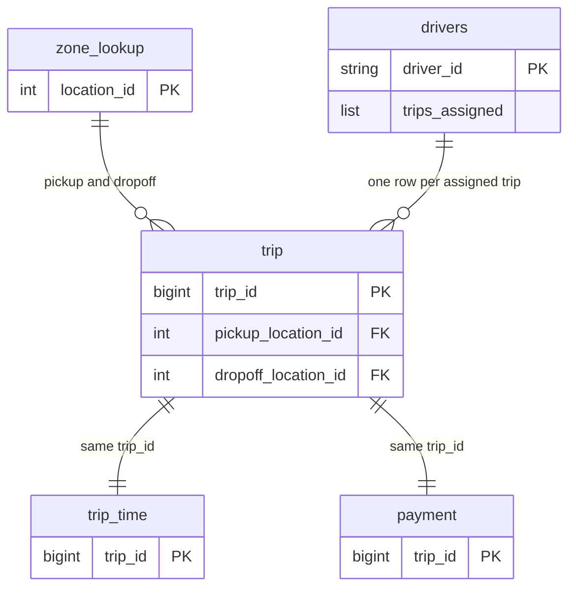

# Rideshare Dataset Guide

A plain-English introduction to the data model this course uses. It explains
what the tables represent, how they relate, and why the row counts and NULLs
change as the pipeline runs.

This guide explains; it never defines. Exact schemas, column types, row
counts, join keys, NULL matrices, Volume paths, and Unity Catalog object names
live in [`dataset-overview.md`](dataset-overview.md), which is the single
source of truth. Where this guide and the overview disagree, the overview is
correct.

## Why this dataset

Every module uses the same rideshare data instead of switching examples. That
choice is deliberate: once you know what a trip record means, each new topic
adds a technique rather than a new problem domain. A join in Module 7 uses the
same keys you filtered in Module 3.

The data is intentionally tiny — around a hundred trips. Small data keeps
feedback fast and makes wrong answers visible, because you can reason about
what the correct row count should be. Nothing here depends on volume; the
patterns are the same ones production pipelines use.

The data is also intentionally imperfect. Some records are duplicated, some
have missing keys, and some carry values that cannot be parsed as numbers.
Those defects are planted, not accidental. They are what makes cleaning,
NULL-safe predicates, and join-cardinality checks worth learning.

## How the tables relate

There is one central fact table of trips. Two tables extend it one-to-one,
each adding a different kind of detail about the same trip. One dimension
table describes locations and is looked up twice per trip — once for pickup,
once for dropoff. A supplementary nested file describes drivers, where each
driver record carries a list of the trips assigned to them.

Only keys are shown above, to keep the shape readable. For the full column
list of any table, see
[Core data model](dataset-overview.md#core-data-model).

Two things about this shape matter later:

- Because the extension tables are one-to-one on the trip key, joining them
  should not change your row count. If it does, something is wrong — usually a
  duplicate key.
- Because locations are looked up twice, the dimension table is joined twice
  in the same query, which forces you to be deliberate about column naming and
  which side you keep.

A few rows in the location table describe places no trip ever visits. That is
on purpose: it gives you a real unmatched-key case, so you can see the
difference between an inner join and a left join instead of being told about
it.

## The pipeline story

Modules 5 through 8 build a small pipeline, each stage feeding the next.

**Module 5 lands the raw files.** The files arrive on a Unity Catalog Volume
in five different formats — one per dataset — so that reading CSV, JSON,
Parquet, XML, and Avro is practised on data you already understand. Nothing is
cleaned yet. This stage also lands the deliberately broken copies used later.

**Module 6 curates.** Built-in functions clean and enrich the landed files,
adding derived columns and normalising inconsistent values. The nested driver
records are flattened here, turning each driver's list of assigned trips into
one row per driver-and-trip pair. Outputs are written as Parquet.

**Module 7 joins.** The curated outputs become managed Delta tables: one wide
enriched trip table, and one table pairing drivers with the trips they drove.
This is where join cardinality and unmatched keys stop being theory.

**Module 8 aggregates.** The enriched tables are summarised into KPI tables —
daily activity, performance by zone, and productivity per driver. Aggregation
is the last step because it depends on everything before it being correct.

## Why row counts change along the way

Row counts are not constant through the pipeline, and each change has a
reason. Understanding the reason is the point; the exact numbers at each stage
are recorded in
[Module pipeline](dataset-overview.md#module-pipeline).

- **The broken input files are larger than the clean ones.** They keep every
  original record and append extra trips, a duplicate of an existing trip, and
  a row whose key is missing.
- **Cleaning removes some of those rows.** A row with no usable key cannot be
  joined or grouped, so it is dropped. A duplicate is collapsed. This is why
  the curated output is smaller than its input but still larger than the
  original clean dataset.
- **The trip and payment stages end up with different counts.** One of the
  appended trips never received a payment record, so the payment side has one
  fewer row. That gap is what produces NULLs in the next stage.
- **Aggregates shrink dramatically, and that is expected.** A KPI table has one
  row per day, per zone, or per driver, so its size reflects how many distinct
  groups exist, not how many trips there were.

## Why NULLs appear after joining

Most NULLs in this course are not missing data in the source. They are the
visible result of a left join that found no match.

When you left-join two tables, every row on the left survives. If the right
table has no matching key, the columns contributed by the right side are
filled with NULL. So the appended trips that exist in the trip data but have
no corresponding time or payment record come out of the join with NULLs in
exactly those columns — and only those columns.

A second source is rejected values. When cleaning finds a value that cannot be
trusted — a negative fare, or text where a number belongs — it replaces that
value with NULL rather than guessing. The row stays; the untrustworthy field
does not.

Two consequences worth carrying forward:

- NULL is not zero and not empty string. Some columns in this dataset use a
  literal `unknown` sentinel string instead of NULL, and the two behave
  differently in grouping and comparison. Which columns do which is recorded in
  the overview.
- Because NULLs are concentrated in known columns for known rows, you can
  always predict what a correct result looks like before running the query.
  The precise map of which columns are NULL for which trips is in
  [Module 7 — Managed analytical tables](dataset-overview.md#module-7--managed-analytical-tables).

## Where the exact facts live

| Question | Answer lives in |
|---|---|
| Column names, types, and row contracts | [Core data model](dataset-overview.md#core-data-model) |
| Which keys join to which | [Join keys](dataset-overview.md#join-keys) |
| Nested driver fields | [Supplementary: `drivers`](dataset-overview.md#supplementary-drivers-nested-xml) |
| Source formats, Volume paths, and per-stage row counts | [Module pipeline](dataset-overview.md#module-pipeline) |
| Which columns are NULL and why | [Module 7 — Managed analytical tables](dataset-overview.md#module-7--managed-analytical-tables) |
| Catalog, schema, volume, and table names | [Unity Catalog platform reference](dataset-overview.md#unity-catalog-platform-reference) |
