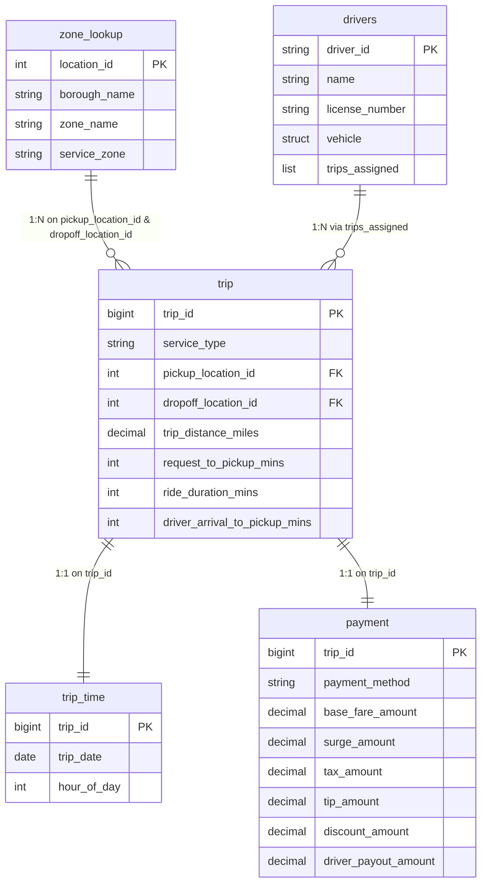

# Dataset Overview — Rideshare

This file serves as the single source of truth for the rideshare data
model. It defines catalogs, schemas, tables, volumes, data grains, join
keys, NULL rules, and the locations of source files and Unity Catalog
objects used throughout the course.

## Contents

- [Core data model](#core-data-model)
  - [Entity-relationship diagram](#entity-relationship-diagram)
- [Supplementary: `drivers`](#supplementary-drivers-nested-xml)
- [Module pipeline](#module-pipeline)
  - [Module 5 — Landing](#module-5--landing)
  - [Module 6 — Curated outputs](#module-6--curated-outputs)
  - [Module 7 — Managed analytical tables](#module-7--managed-analytical-tables)
  - [Module 8 — KPI outputs](#module-8--kpi-outputs)
- [Unity Catalog platform reference](#unity-catalog-platform-reference)

---

## Core data model

### Summary

100-row / 22-row **contracts**. Modules 1–4 use small hand-built DataFrames
aligned with these schemas — not these files. File reads start in Module 5.
Module 6+ curated and managed tables are larger derivatives — see
[Module pipeline](#module-pipeline); they do not change these contracts.

| Table | Rows | Role |
|---|---:|---|
| `trip` | 100 | Central fact table |
| `trip_time` | 100 | 1:1 extension of `trip` — date and time |
| `payment` | 100 | 1:1 extension of `trip` — fare breakdown |
| `zone_lookup` | 22 | Dimension — pickup/dropoff locations |

### `trip`

| Column | Type |
|---|---|
| `trip_id` | bigint |
| `service_type` | string |
| `pickup_location_id` | int |
| `dropoff_location_id` | int |
| `trip_distance_miles` | decimal(8,2) |
| `request_to_pickup_mins` | int |
| `ride_duration_mins` | int |
| `driver_arrival_to_pickup_mins` | int |

### `trip_time`

| Column | Type |
|---|---|
| `trip_id` | bigint |
| `trip_date` | date |
| `hour_of_day` | int |

**Date range:** 100 trips span **2026-03-01 – 2026-03-14** (14 distinct dates).

### `payment`

| Column | Type |
|---|---|
| `trip_id` | bigint |
| `payment_method` | string |
| `base_fare_amount` | decimal(10,2) |
| `surge_amount` | decimal(10,2) |
| `tax_amount` | decimal(10,2) |
| `tip_amount` | decimal(10,2) |
| `discount_amount` | decimal(10,2) |
| `driver_payout_amount` | decimal(10,2) |

### `zone_lookup`

| Column | Type |
|---|---|
| `location_id` | int |
| `borough_name` | string |
| `zone_name` | string |
| `service_zone` | string |

### Join keys

- `trip.trip_id = trip_time.trip_id`
- `trip.trip_id = payment.trip_id`
- `trip.pickup_location_id = zone_lookup.location_id`
- `trip.dropoff_location_id = zone_lookup.location_id`

**Zone coverage:** every `trip` pickup/dropoff uses `location_id` **1–20**
only. `zone_lookup` rows **21** (`zone_name` = `Newark Airport`) and **22**
(`Hoboken Terminal`) are intentionally unmatched. Both sit in
`borough_name` = `New Jersey`.

### Entity-relationship diagram



---

## Supplementary: `drivers` (nested XML)

12 `<driver>` records — not a fifth core table.

| Field | Type |
|---|---|
| `driver_id` | string, e.g. `D001` |
| `name` | string |
| `license_number` | string |
| `vehicle` | struct — `make`, `model`, `year`, `body_type` |
| `trips_assigned` | repeated `trip_id` list |

---

## Module pipeline

End-to-end flow: **Module 5** lands source files → **Module 6** produces
curated Parquet → **Module 7** builds managed Delta tables → **Module 8**
writes managed Delta KPI tables.

### Module 5 — Landing

Module 5 Notebook **01** ingests all source files into the Unity Catalog
Volume. Format and transform notebooks use `/Volumes/...` paths — not
hardcoded `abfss://` URLs. Setup/teardown (Notebooks **01** / **99**) may
use a config-built `abfss://` root for external-location / managed-location
DDL and ADLS teardown only.

#### Source files

| Dataset | Format | Repo source (Git) | Volume destination |
|---|---|---|---|
| `trip` | CSV | `data/raw/csv/trip.csv` | `…/landing/source_files/trip/` |
| `trip_time` | Parquet | `data/raw/parquet/trip_time.parquet` | `…/landing/source_files/trip_time/` |
| `zone_lookup` | JSON Lines | `data/raw/json/zone_lookup.json` | `…/landing/source_files/zone_lookup/` |
| `drivers` | XML | `data/raw/xml/drivers.xml` | `…/landing/source_files/drivers/` |
| `payment` | Avro | `data/raw/avro/payment.avro` | `…/landing/source_files/payment/` |

Canonical `zone_lookup` JSON is newline-delimited. Extra CSV, JSON, and
Parquet copies of the core tables exist under `data/raw/` for authoring;
Module 5 lands **one** format per dataset (table above). `drivers` is XML
only.

#### Controlled-bad variants

Module 5 Notebook **01** also lands two full-size bad CSVs. Module 6 Notebook
**03** uses them as its only trip and payment inputs (they do **not** replace
the 100-row core contracts used by other source-reading notebooks).

| Purpose | Repo source (Git) | Volume destination | Source rows | Curated rows |
|---|---|---|---:|---:|
| Trip cleaning | `data/raw/csv/bad_trip_data.csv` | `…/landing/source_files/trip/bad_trip_data.csv` | 108 | 106 |
| Payment cleaning | `data/raw/csv/bad_payment_data.csv` | `…/landing/source_files/payment/bad_payment_data.csv` | 106 | 105 |

Both files keep the CSV header and all 100 original records.

- **`bad_trip_data`:** appends trips 101–106, one duplicate of trip 101, and
  one missing-key row.
- **`bad_payment_data`:** appends five uniquely keyed rows (101–105) plus one
  missing-key row (no payment for trip 106).

### Module 6 — Curated outputs

Parquet under `/Volumes/rideshare_dev/processed/output_files/curated/{name}/`.

| Output | Grain / rows |
|---|---|
| `curated/drivers_flat/` | One row per (`driver_id`, `trip_id`); trips **1–100** |
| `curated/trip/` | One row per `trip_id` — **106** (from `bad_trip_data.csv`) |
| `curated/payment/` | One row per `trip_id` — **105** (from `bad_payment_data.csv`; no row for trip 106) |

#### `curated/trip` schema

| Column | Type |
|---|---|
| `trip_id` | bigint |
| `service_type` | string |
| `service_label` | string |
| `pickup_location_id` | int |
| `dropoff_location_id` | int |
| `trip_distance_miles` | decimal(8,2) |
| `trip_distance_km` | double |
| `request_to_pickup_mins` | int |
| `driver_arrival_to_pickup_mins` | int |
| `request_to_driver_arrival_mins` | int |
| `ride_duration_mins` | int |
| `diff_ride_duration_wait_mins` | int |
| `ride_duration_band` | string |

#### `curated/payment` schema

| Column | Type |
|---|---|
| `trip_id` | bigint |
| `payment_method` | string |
| `base_fare_amount` | decimal(10,2) |
| `surge_amount` | decimal(10,2) |
| `tax_amount` | decimal(10,2) |
| `tip_amount` | decimal(10,2) |
| `discount_amount` | decimal(10,2) |
| `driver_payout_amount` | decimal(10,2) |
| `charge_before_tip` | decimal(16,2) |
| `tip_percent_of_base` | decimal(16,1) |

#### `drivers_flat` schema

| Column | Type |
|---|---|
| `driver_id` | string |
| `driver_name` | string |
| `license_number` | string |
| `vehicle_make` | string |
| `vehicle_model` | string |
| `vehicle_year` | long |
| `vehicle_body_type` | string |
| `trip_id` | bigint |

### Module 7 — Managed analytical tables

| Table | Grain / rows | Columns |
|---|---|---:|
| `rideshare_dev.processed.trip_enriched` | One row per curated `trip_id` — **106** | 16 |
| `rideshare_dev.processed.trip_driver_assignment` | One row per (`driver_id`, `trip_id`) — **100** (trips 101–106 have no assignment) | 13 |

#### `trip_enriched`

| Column | Type |
|---|---|
| `trip_id` | bigint |
| `service_type` | string |
| `pickup_location_id` | int |
| `dropoff_location_id` | int |
| `trip_distance_miles` | decimal(8,2) |
| `ride_duration_mins` | int |
| `trip_date` | date |
| `hour_of_day` | int |
| `payment_method` | string |
| `base_fare_amount` | decimal(10,2) |
| `tip_amount` | decimal(10,2) |
| `driver_payout_amount` | decimal(10,2) |
| `pickup_borough` | string |
| `pickup_zone` | string |
| `dropoff_borough` | string |
| `dropoff_zone` | string |

**Normalized group-key values** (after Module 6): `service_type` is
**uppercase** (`STANDARD`, `SHARED`, `PREMIUM`, `XL`, `UNKNOWN`).
`payment_method` is **lowercase** (`card`, `wallet`, `cash`,
`corporate`, `unknown`, plus **1 NULL** for trip 106).
`UNKNOWN` / `unknown` are string sentinels, **not** NULL.

**Inherited NULLs.**

| Column(s) | NULL on `trip_id` | Rows | Cause |
|---|---|---:|---|
| `trip_date`, `hour_of_day` | 101–106 | 6 | `trip_time` has only 100 rows — left join |
| `payment_method`, `driver_payout_amount` | 106 | 1 | `curated/payment` has 105 rows — left join |
| `base_fare_amount` | 104, 106 | 2 | Left join **plus** trip 104 negative fare rejected in Module 6 |
| `tip_amount` | 103, 106 | 2 | Left join **plus** trip 103 `not_a_number` tip rejected in Module 6 |
| `trip_distance_miles` | 103, 105, 106 | 3 | Module 6 positive-value rule |

`ride_duration_mins`, `service_type`, and the four zone columns have **no**
NULLs.

#### `trip_driver_assignment`

| Column | Type |
|---|---|
| `driver_id` | string |
| `driver_name` | string |
| `license_number` | string |
| `vehicle_make` | string |
| `vehicle_model` | string |
| `vehicle_year` | long |
| `vehicle_body_type` | string |
| `trip_id` | bigint |
| `service_type` | string |
| `trip_distance_miles` | decimal(8,2) |
| `ride_duration_mins` | int |
| `pickup_location_id` | int |
| `dropoff_location_id` | int |

**NULLs:** None.

### Module 8 — KPI outputs

Full column contracts:
[Module 8 README — Paths and outputs](../../08%20-%20Aggregations%20and%20Window%20Functions/README.md#paths-and-outputs).

| Table | Grain / rows | Source table |
|---|---|---|
| `rideshare_dev.processed.kpi_daily_trip_summary` | One row per **`trip_date`** — **14** (drops NULL-`trip_date` trips 101–106) | `trip_enriched` |
| `rideshare_dev.processed.kpi_zone_performance` | One row per (**`pickup_borough`**, **`pickup_zone`**) — **20** | `trip_enriched` |
| `rideshare_dev.processed.kpi_driver_productivity` | One row per **`driver_id`** — **12** | `trip_driver_assignment` |

---

## Unity Catalog platform reference

### UC objects

| Platform piece | Value |
|---|---|
| Catalog | `rideshare_dev` |
| Schemas | `landing`, `processed` |
| Volumes | `landing.source_files`, `processed.output_files` |
| External location | `el_rideshare_dev` |
| Storage credential | Student-provided name in the config cell |

### Managed tables

All six are Unity Catalog managed Delta in `rideshare_dev.processed`
(`landing` has none).

| Table | Module | Grain / rows |
|---|---|---|
| `rideshare_dev.processed.trip_time_preview` | 5 | Same as `trip_time` — **100** |
| `rideshare_dev.processed.trip_enriched` | 7 | One row per curated `trip_id` — **106** |
| `rideshare_dev.processed.trip_driver_assignment` | 7 | One row per (`driver_id`, `trip_id`) — **100** |
| `rideshare_dev.processed.kpi_daily_trip_summary` | 8 | One row per `trip_date` — **14** |
| `rideshare_dev.processed.kpi_zone_performance` | 8 | One row per (`pickup_borough`, `pickup_zone`) — **20** |
| `rideshare_dev.processed.kpi_driver_productivity` | 8 | One row per `driver_id` — **12** |

### Glossary

| Term | Meaning |
|---|---|
| Schema `landing` / `processed` | Unity Catalog schemas under `rideshare_dev` — **not** medallion Bronze/Silver/Gold |
| Volume `source_files` / `output_files` | External volumes under those schemas |
| Folder `practice/` / `curated/` | Directories inside `output_files` (created on first write) |

### Path patterns

```text
/Volumes/rideshare_dev/landing/source_files/{dataset}/
/Volumes/rideshare_dev/processed/output_files/practice/{output_name}/
/Volumes/rideshare_dev/processed/output_files/curated/{output_name}/
```

**Write rules:**

| Stage | Destination |
|---|---|
| Module 5 practice | `…/processed/output_files/practice/{output_name}/` (Module 5 only) |
| Module 6 curated Parquet | `…/processed/output_files/curated/{output_name}/` |
| Module 7 analytical tables | Unity Catalog managed tables (`saveAsTable`) — not Volume folders |
| Module 8 KPI tables | Unity Catalog managed tables (`saveAsTable`) in `rideshare_dev.processed` (`kpi_*`) |
