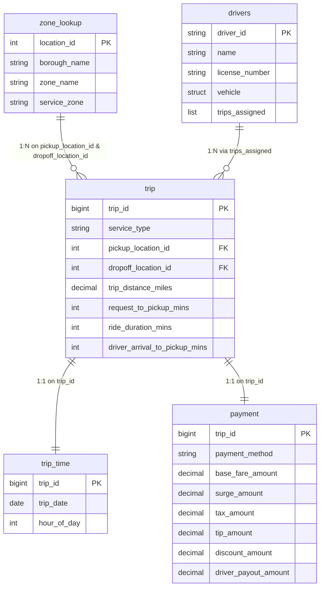

# Dataset Overview — Rideshare

Canonical source for the rideshare dataset: logical tables, schemas, join
keys, and physical layout (source files + Unity Catalog Volume paths).
Referenced by `.cursor/rules/learner-notebooks.mdc`, slash commands
(`/new-lesson`, `/write-lesson`, `/validate-notebook`, `/review-module`), and
`AGENTS.md` — do not duplicate this content elsewhere. Module notebook
sequences and privileges live in that module's `README.md`.

**Dataset size:** Intentionally small — 100 / 100 / 100 / 22 core rows — for
fast iteration. Not designed for shuffle, spill, or skew at volume (Module 17
uses it for plan-reading only).

## Contents

- [Core data model](#core-data-model)
  - [Entity-relationship diagram](#entity-relationship-diagram)
- [Supplementary: `drivers`](#supplementary-drivers-nested-xml)
- [Module pipeline](#module-pipeline)
  - [Module 5 — Landing](#module-5--landing)
  - [Module 6 — Curated outputs](#module-6--curated-outputs)
  - [Module 7 — Managed analytical tables](#module-7--managed-analytical-tables)
  - [Module 8 — KPI outputs](#module-8--kpi-outputs)
- [Unity Catalog platform reference](#unity-catalog-platform-reference)

---

## Core data model

### Summary

100-row / 22-row **contracts** used by Modules 1–5 and by source-reading
notebooks. Module 6+ curated and managed tables are larger derivatives — see
[Module pipeline](#module-pipeline); they do not change these contracts.

| Table | Rows | Role |
|---|---:|---|
| `trip` | 100 | Central fact table |
| `trip_time` | 100 | 1:1 extension of `trip` — date and time |
| `payment` | 100 | 1:1 extension of `trip` — fare breakdown |
| `zone_lookup` | 22 | Dimension — pickup/dropoff locations |

### `trip`

| Column | Type |
|---|---|
| `trip_id` | bigint |
| `service_type` | string |
| `pickup_location_id` | int |
| `dropoff_location_id` | int |
| `trip_distance_miles` | decimal(8,2) |
| `request_to_pickup_mins` | int |
| `ride_duration_mins` | int |
| `driver_arrival_to_pickup_mins` | int |

### `trip_time`

| Column | Type |
|---|---|
| `trip_id` | bigint |
| `trip_date` | date |
| `hour_of_day` | int |

**Date range:** 100 trips span **2026-03-01 – 2026-03-14** (14 distinct dates; ~7 trips per date on average).

### `payment`

| Column | Type |
|---|---|
| `trip_id` | bigint |
| `payment_method` | string |
| `base_fare_amount` | decimal(10,2) |
| `surge_amount` | decimal(10,2) |
| `tax_amount` | decimal(10,2) |
| `tip_amount` | decimal(10,2) |
| `discount_amount` | decimal(10,2) |
| `driver_payout_amount` | decimal(10,2) |

### `zone_lookup`

| Column | Type |
|---|---|
| `location_id` | int |
| `borough_name` | string |
| `zone_name` | string |
| `service_zone` | string |

### Join keys

- `trip.trip_id = trip_time.trip_id`
- `trip.trip_id = payment.trip_id`
- `trip.pickup_location_id = zone_lookup.location_id`
- `trip.dropoff_location_id = zone_lookup.location_id`

**Zone coverage:** every `trip` pickup/dropoff (core rows **and** curated
trips 101–106) uses `location_id` **1–20** only. `zone_lookup` rows **21**
(`zone_name` = `Newark Airport`) and **22** (`Hoboken Terminal`) are
intentionally unmatched so Module 7 can teach right/full-outer joins on
real data. Both sit in `borough_name` = `New Jersey`.

### Entity-relationship diagram

Source entity-relationship diagram for the 4 core logical tables plus the
supplementary `drivers` source file.



> `zone_lookup` connects to `trip` (**1:N**) for both `pickup_location_id` and `dropoff_location_id`.
> `trip_time` and `payment` share a **1:1** relationship with `trip` on `trip_id`.
> `drivers` is a supplementary XML source with a **1:N** nested array (`trips_assigned`) containing assigned `trip_id`s.

---

## Supplementary: `drivers` (nested XML)

12 `<driver>` records — not a fifth core table. Landing path:
`landing/source_files/drivers/`.

| Field | Type |
|---|---|
| `driver_id` | string, e.g. `D001` |
| `name` | string |
| `license_number` | string |
| `vehicle` | struct — `make`, `model`, `year`, `body_type` |
| `trips_assigned` | repeated `trip_id` list |

Module 6 Notebook **02** flattens this to `curated/drivers_flat/`
(`name` → `driver_name`, `vehicle.*` exploded to columns,
`explode` on `trips_assigned`). Joinable to `trip` on `trip_id` after flatten.

---

## Module pipeline

End-to-end flow: **Module 5** lands source files → **Module 6** produces
curated Parquet → **Module 7** builds managed Delta tables → **Module 8**
writes managed Delta KPI tables.

### Module 5 — Landing

Module 5 Notebook **01** ingests all source files into the Unity Catalog
Volume. Format and transform notebooks use `/Volumes/...` paths — not
hardcoded `abfss://` URLs. Setup/teardown (Notebooks **01** / **99**) may
use a config-built `abfss://` root for external-location / managed-location
DDL and ADLS teardown only.

#### Source files

| Dataset | Format | Repo source (Git) | Volume destination |
|---|---|---|---|
| `trip` | CSV | `data/raw/csv/trip.csv` | `…/landing/source_files/trip/` |
| `trip_time` | Parquet | `data/raw/parquet/trip_time.parquet` | `…/landing/source_files/trip_time/` |
| `zone_lookup` | JSON Lines | `data/raw/json/zone_lookup.json` | `…/landing/source_files/zone_lookup/` |
| `drivers` | XML | `data/raw/xml/drivers.xml` | `…/landing/source_files/drivers/` |
| `payment` | Avro | `data/raw/avro/payment.avro` | `…/landing/source_files/payment/` |

JSON is newline-delimited; Parquet preserves decimals. Other payment formats
may exist under `data/raw/` for authoring; Module 5's primary `payment` read
is Avro.

#### Controlled-bad variants

Module 5 Notebook **01** also lands two full-size bad CSVs. Module 6 Notebook
**03** uses them as its only trip and payment inputs (they do **not** replace
the 100-row core contracts used by other source-reading notebooks).

| Purpose | Repo source (Git) | Volume destination | Source rows | Curated rows |
|---|---|---|---:|---:|
| Trip cleaning | `data/raw/csv/bad_trip_data.csv` | `…/landing/source_files/trip/bad_trip_data.csv` | 108 | 106 |
| Payment cleaning | `data/raw/csv/bad_payment_data.csv` | `…/landing/source_files/payment/bad_payment_data.csv` | 106 | 105 |

Both files keep the CSV header and all 100 original records.

- **`bad_trip_data`:** appends trips 101–106, one duplicate of trip 101, and
  one missing-key row → Module 6 rejects the missing key, `dropDuplicates` on
  `trip_id`, cleans values → **106** curated trip rows.
- **`bad_payment_data`:** appends five uniquely keyed rows (101–105) plus one
  missing-key row → Module 6 rejects the missing key, cleans values → **105**
  curated payment rows (no payment for trip 106).

### Module 6 — Curated outputs

Parquet under `/Volumes/rideshare_dev/processed/output_files/curated/{name}/`.

| Output | Grain / rows | Produced by |
|---|---|---|
| `curated/drivers_flat/` | One row per (`driver_id`, `trip_id`); trips **1–100** | Notebook **02** |
| `curated/trip/` | One row per `trip_id` — **106** (from `bad_trip_data.csv`) | Notebook **03** |
| `curated/payment/` | One row per `trip_id` — **105** (from `bad_payment_data.csv`; no row for trip 106) | Notebook **03** |

`curated/trip/` and `curated/payment/` keep the core columns plus Module 6
enrichment columns (e.g. `service_label`, `trip_distance_km`,
`charge_before_tip`). Those enrichments stay in curated sources — they are
**not** promoted into Module 7 managed tables (BRD).

#### `drivers_flat` schema

| Column | Type |
|---|---|
| `driver_id` | string |
| `driver_name` | string |
| `license_number` | string |
| `vehicle_make` | string |
| `vehicle_model` | string |
| `vehicle_year` | long |
| `vehicle_body_type` | string |
| `trip_id` | bigint |

### Module 7 — Managed analytical tables

Unity Catalog managed Delta tables written by Module 7 Notebook **07**.
Modules 8–9 read these as their primary sources.

Source-to-target mappings (joins / transforms):
[`trip_enriched_mapping.md`](../../07%20-%20Joins%20and%20Set%20Operations/requirements/trip_enriched_mapping.md),
[`trip_driver_assignment_mapping.md`](../../07%20-%20Joins%20and%20Set%20Operations/requirements/trip_driver_assignment_mapping.md).

| Table | Grain / rows | Columns |
|---|---|---:|
| `rideshare_dev.processed.trip_enriched` | One row per curated `trip_id` — **106** | 16 |
| `rideshare_dev.processed.trip_driver_assignment` | One row per (`driver_id`, `trip_id`) — **100** (trips 101–106 have no assignment) | 13 |

#### `trip_enriched`

Built from `curated/trip` left-joined to landing `trip_time`,
`curated/payment`, and pickup/dropoff `zone_lookup` (broadcast).

| Column | Type |
|---|---|
| `trip_id` | bigint |
| `service_type` | string |
| `pickup_location_id` | int |
| `dropoff_location_id` | int |
| `trip_distance_miles` | decimal(8,2) |
| `ride_duration_mins` | int |
| `trip_date` | date |
| `hour_of_day` | int |
| `payment_method` | string |
| `base_fare_amount` | decimal(10,2) |
| `tip_amount` | decimal(10,2) |
| `driver_payout_amount` | decimal(10,2) |
| `pickup_borough` | string |
| `pickup_zone` | string |
| `dropoff_borough` | string |
| `dropoff_zone` | string |

**Not promoted:** operational timing (`request_to_pickup_mins`,
`driver_arrival_to_pickup_mins`) and full payment breakdown (`surge_amount`,
`tax_amount`, `discount_amount`) — remain in curated sources.

**Normalized group-key values** (after Module 6): `service_type` is
**uppercase** (`STANDARD` 55, `SHARED` 21, `PREMIUM` 16, `XL` 12,
`UNKNOWN` 2). `payment_method` is **lowercase** (`card` 59, `wallet` 20,
`cash` 17, `corporate` 8, `unknown` 1, plus **1 NULL** for trip 106).
`UNKNOWN` / `unknown` are string sentinels, **not** NULL.

**Inherited NULLs** — teaching material for Modules 7–8, not a defect. Each
measure has its own non-NULL count (join gaps **and** Module 6 value
rejection).

| Column(s) | NULL on `trip_id` | Rows | Cause |
|---|---|---:|---|
| `trip_date`, `hour_of_day` | 101–106 | 6 | `trip_time` has only 100 rows — left join |
| `payment_method`, `driver_payout_amount` | 106 | 1 | `curated/payment` has 105 rows — left join |
| `base_fare_amount` | 104, 106 | 2 | Left join **plus** trip 104 negative fare rejected in Module 6 |
| `tip_amount` | 103, 106 | 2 | Left join **plus** trip 103 `not_a_number` tip rejected in Module 6 |
| `trip_distance_miles` | 103, 105, 106 | 3 | Module 6 positive-value rule |

`ride_duration_mins`, `service_type`, and the four zone columns have **no**
NULLs (every trip matches `location_id` 1–20).

#### `trip_driver_assignment`

Built from `curated/drivers_flat` left-joined to `curated/trip`. Time,
payment, and zone-name attributes are **not** here — join `trip_enriched`
on `trip_id` when needed.

| Column | Type |
|---|---|
| `driver_id` | string |
| `driver_name` | string |
| `license_number` | string |
| `vehicle_make` | string |
| `vehicle_model` | string |
| `vehicle_year` | long |
| `vehicle_body_type` | string |
| `trip_id` | bigint |
| `service_type` | string |
| `trip_distance_miles` | decimal(8,2) |
| `ride_duration_mins` | int |
| `pickup_location_id` | int |
| `dropoff_location_id` | int |

**NULLs:** None. All Module 6 value rejections affect trips 101–106; this
table joins trips 1–100 only, so every column is fully populated.

### Module 8 — KPI outputs

Unity Catalog managed Delta tables written by Module 8 Notebook **08** with
`.mode("overwrite").saveAsTable(...)`. Module 9 Notebook **04** reads the
daily and zone tables. Notebook **06** (`06 - End-to-End SQL Pipeline`)
rebuilds all three contracts in Spark SQL from the source tables
(read-only). Full column contracts:
[Module 8 README — Paths and outputs](../../08%20-%20Aggregations%20and%20Window%20Functions/README.md#paths-and-outputs).

| Table | Grain / rows | Source table |
|---|---|---|
| `rideshare_dev.processed.kpi_daily_trip_summary` | One row per **`trip_date`** — **14** (NULL-`trip_date` trips 101–106 excluded; measure-NULL trips 103–106 are inside that undated set, so dated rows 1–100 are fully populated) | `trip_enriched` |
| `rideshare_dev.processed.kpi_zone_performance` | One row per (**`pickup_borough`**, **`pickup_zone`**) — **20** | `trip_enriched` |
| `rideshare_dev.processed.kpi_driver_productivity` | One row per **`driver_id`** — **12** | `trip_driver_assignment` |

Cleared by Module 5 **`99`** Level 4 (catalog teardown), same as Module 7
managed tables — not by Level 2 `curated/` cleanup.
---

## Unity Catalog platform reference

Each student uses their own Azure storage and Databricks workspace. Course
object names below are fixed; Azure account/container/credential values are
set in the Notebook 01 / 99 config cell. Modules 1–4 use hand-built
DataFrames in code — no Volume paths.

### UC objects

| Platform piece | Value |
|---|---|
| Catalog | `rideshare_dev` |
| Schemas | `landing`, `processed` |
| Volumes | `landing.source_files`, `processed.output_files` |
| External location | `el_rideshare_dev` (Module 5 Notebook 01) |
| Storage credential | Student-provided name in the config cell |
| Preview managed table | `rideshare_dev.processed.trip_time_preview` (Module 5 Notebook **07**; Module 6 Notebook **01** reads it alongside landing `trip_time`) |

### Glossary

| Term | Meaning |
|---|---|
| Schema `landing` / `processed` | Unity Catalog schemas under `rideshare_dev` — **not** medallion Bronze/Silver/Gold (Modules 12–13) |
| Volume `source_files` / `output_files` | External volumes under those schemas |
| Folder `practice/` / `curated/` | Directories inside `output_files` (created on first write) |

Do not write "processed/" alone in notebooks — use the full Volume path or
the `practice/` / `curated/` tier.

### Path patterns

```text
/Volumes/rideshare_dev/landing/source_files/{dataset}/
/Volumes/rideshare_dev/processed/output_files/practice/{output_name}/
/Volumes/rideshare_dev/processed/output_files/curated/{output_name}/
```

**Write rules:**

| Stage | Destination |
|---|---|
| Module 5 practice | `…/processed/output_files/practice/{output_name}/` |
| Module 6 curated Parquet | `…/processed/output_files/curated/{output_name}/` |
| Module 7 analytical tables | Unity Catalog managed tables (`saveAsTable`) — not Volume folders |
| Module 8 KPI tables | Unity Catalog managed tables (`saveAsTable`) in `rideshare_dev.processed` (`kpi_*`) |

Do not read `practice/` after Module 5. Later modules read landing,
prior `curated/` outputs, Module 7 managed tables, and/or Module 8 KPI
managed tables.