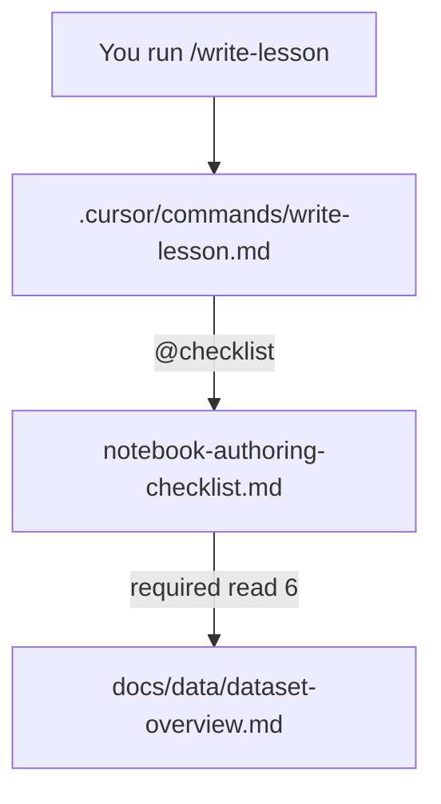

# Dataset overview fixes — author notes

Scratch notes from the `docs/data/dataset-overview.md` polish. Append more
items below.

---

## How Commands Load `dataset-overview.md`

The `@path` directive means "read this file." It belongs on the **caller** — never on the file being read. Adding a "Referenced by" comment to `dataset-overview.md` itself has no effect.

### Loading chain

The same chain applies to `/new-lesson`, `/validate-notebook`, and `/review-module`.

### Second entry point

Editing a notebook file (`NN - */*.py`) triggers `learner-notebooks.mdc`, which also `@`-references both the checklist and `dataset-overview.md`.

### Adding a new file to the load graph

Add an `@path` reference in one of two places:

- **The checklist** — picked up by all notebook commands.
- **A specific command or rule** — scoped to that command only.

Do **not** add a "Referenced by" line to the new file itself; it has no effect on loading.

### Change log

- Removed the stale "Referenced by" paragraph from `dataset-overview.md`. The checklist already loads it via `@path`, so no reference was lost.
