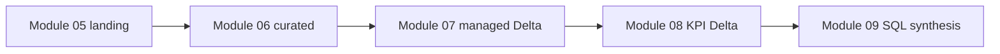

---
aliases:
  - Course Decisions
  - Decision Log
tags:
  - course/decisions
  - architecture
updated: 2026-08-23
---

# Course decisions

Index of **accepted** architecture, data, and pedagogy choices. Canonical
detail stays in the linked sources — this file records the decision and where
to read more.

Source precedence for facts: [AGENTS](../AGENTS.md) **Read for facts** section.
Roadmap status: [COURSE_MODULES](../COURSE_MODULES.md).

## Platform and scope

### D-001 — Batch data engineering only

Teach production-oriented **batch** pipelines. Exclude Structured Streaming,
Auto Loader, streaming tables, machine learning, and general Azure
infrastructure administration. Assume basic Python and SQL; no prior Spark or
Databricks experience required.

Sources: [README](../README.md), [COURSE_MODULES](../COURSE_MODULES.md)

### D-002 — Azure Databricks + Unity Catalog baseline

Azure Databricks Premium, Unity Catalog enabled, Databricks Runtime **17.3
LTS**, Spark **4.0.0**, Python **3.12**, Scala **2.13**. Do not claim a DBR
pin for serverless — it uses independently versioned environments.

Sources: [README — Technical baseline](../README.md#technical-baseline),
[compute validation policy](../docs/standards/compute-validation-policy.md)

### D-003 — Databricks source `.py` notebooks

Learner notebooks are `.py` with first line `# Databricks notebook source`,
`# COMMAND ----------` cell boundaries, and `# MAGIC` for markdown/SQL. Never
`.ipynb`.

Source: [notebook content standard](../docs/standards/notebook-content-standard.md)

### D-004 — GitHub is canonical remote

```text
Cursor local authoring → GitHub → Azure Databricks Git folder
```

Spark, Delta, and Unity Catalog run only in Azure Databricks. Local tooling
covers formatting, linting, typing, and non-Spark checks.

Sources: [README — Development workflow](../README.md#development-workflow),
[coding standards](../docs/standards/coding-standards.md)

### D-005 — Documentation owners

| Artifact | Owns |
|---|---|
| `COURSE_MODULES.md` | Roadmap, prerequisites, production relevance, status |
| Module `README.md` | Lesson design, outputs, minimum privileges |
| `docs/data/dataset-overview.md` | Schemas, keys, paths, pipeline contracts |
| `docs/standards/` | Shared authoring and policy |
| `AGENTS.md` | Agent constraints and source precedence |

Agents do not auto-update roadmap status.

## Data and pipeline

### D-006 — One rideshare dataset throughout

`trip`, `trip_time`, `payment`, `zone_lookup`, and nested `drivers` thread
through every module. Zones **21–22** are intentionally unmatched for outer-join
teaching.

Source: [dataset overview](../docs/data/dataset-overview.md)

### D-007 — Phase II pipeline progression



Modules after 05 do not read `practice/`. Module 10 teaches Delta on isolated
lab objects and does not mutate teaching tables.

Source: [dataset overview — Module pipeline](../docs/data/dataset-overview.md#module-pipeline)

### D-008 — `landing` / `processed` are not medallion layers

Catalog `rideshare_dev`; schemas `landing` and `processed`; volumes
`landing.source_files` and `processed.output_files`; folders `practice/` and
`curated/` inside the output volume. Formal medallion design is Module **13**;
first medallion build is Module **14**.

Source: [dataset overview](../docs/data/dataset-overview.md)

### D-009 — Fixed UC names; learner supplies storage

Course catalog, schema, volume, table, and external-location names are fixed.
Each learner supplies storage account, container, credential, and ADLS path in
Module 05 config cells. Storage credential creation is in course PDF material,
not this repo.

Sources: [Module 05 README](../05%20-%20Reading,%20Writing,%20and%20Schemas/README.md),
[permissions and governance](../docs/standards/permissions-and-governance.md)

### D-010 — Three permission systems

Azure RBAC, Databricks workspace permissions, and Unity Catalog privileges
are separate. UC reads need `USE CATALOG → USE SCHEMA → object privilege`.

Source: [permissions and governance](../docs/standards/permissions-and-governance.md)

## Authoring and validation

### D-011 — Standard all-purpose first

Validate on classic all-purpose **Standard** first. Use **Dedicated** only for
a verified API or teaching reason — never to hide a defect. Treat serverless as
a compatibility check. Jobs and pipeline-managed compute only in modules that
teach those systems.

Source: [compute validation policy](../docs/standards/compute-validation-policy.md)

### D-012 — Concrete, deliberate teaching

Explain before use; one concept path per notebook; worked example before
exercise; call out production mistakes; depth over API breadth.

Source: [notebook content standard](../docs/standards/notebook-content-standard.md)

### D-013 — DataFrame API and built-ins default

`from pyspark.sql import functions as F`; built-ins over UDFs; avoid
`.collect()` / `.toPandas()` unless data is small. Module 09 formalizes
dual-API patterns.

Source: [coding standards](../docs/standards/coding-standards.md)

### D-014 — Explicit schemas and safe conversions

Prefer explicit schemas over inference in production-shaped lessons. Under Spark
4 ANSI, prefer `try_cast` and `try_*` over disabling ANSI. Normalize before
drop/fill; keep rejected rows visible.

Sources: [Module 03 README](../03%20-%20Data%20Cleaning,%20NULL%20Semantics,%20and%20Type%20Handling/README.md),
[Module 05 README](../05%20-%20Reading,%20Writing,%20and%20Schemas/README.md)

## Module-specific contracts

### D-015 — Module 05 primary source formats

| Dataset | Format |
|---|---|
| `trip` | CSV |
| `trip_time` | Parquet |
| `payment` | Avro |
| `zone_lookup` | JSON Lines (22 rows — not the 20-row Parquet alternate) |
| `drivers` | XML |

Source: [Module 05 README](../05%20-%20Reading,%20Writing,%20and%20Schemas/README.md)

### D-016 — Module 06 curated outputs

`curated/trip/` (106 rows), `curated/payment/` (105 rows),
`curated/drivers_flat/`; `service_type` uppercase; `payment_method` lowercase;
`UNKNOWN` / `unknown` are string sentinels. Derived enrichments stay in curated
sources — they do not auto-flow to Module 07 targets.

Source: [Module 06 README](../06%20-%20Built-in%20Functions,%20Complex%20Types,%20and%20UDF%20Alternatives/README.md)

### D-017 — Module 07 join discipline

Know input grain before joining; predict → run → verify. For duplicate keys with
different payloads, use `Window` + `row_number` — not arbitrary
`dropDuplicates`.

Source: [Module 07 README](../07%20-%20Joins%20and%20Set%20Operations/README.md)

### D-018 — Module 07 managed table contracts

Approved 2026-08-05; runtime-verified.

| Table | Grain | Rows × cols |
|---|---|---|
| `trip_enriched` | one row per `trip_id` | 106 × 16 |
| `trip_driver_assignment` | one row per (`driver_id`, `trip_id`) | 100 × 13 |

Excludes operational timing, full payment breakdown, and derived curated
enrichments. Production medallion tables are built in Module **14**.

Sources:
[BRD](../07%20-%20Joins%20and%20Set%20Operations/requirements/BRD.md),
[mappings](../07%20-%20Joins%20and%20Set%20Operations/requirements/)

### D-019 — Module 08 aggregation and window grain

Name output grain before and after aggregation. `groupBy` reduces rows;
windows preserve row count until a later filter. Top-N: `row_number <= N` vs
`rank <= N`; NULL sort placement must be intentional.

Source: [Module 08 README](../08%20-%20Aggregations%20and%20Window%20Functions/README.md)

### D-020 — Module 08 KPI managed Delta tables

| Table | Grain | Rows |
|---|---|---|
| `kpi_daily_trip_summary` | non-NULL `trip_date` | 14 |
| `kpi_zone_performance` | pickup borough + zone | 20 |
| `kpi_driver_productivity` | `driver_id` | 12 |

Managed Delta via `saveAsTable`; cleanup via Module 05 **99** Level 4.

Source: [Module 08 README](../08%20-%20Aggregations%20and%20Window%20Functions/README.md)

### D-021 — 21-module roadmap (Phase III–V)

**Accepted 2026-08-13; extended to 21 modules.** [COURSE_MODULES](../COURSE_MODULES.md)
is the live owner of titles and status. Module numbers below are the current
ownership map — they supersede older references in D-008 and D-018.

| Module | Ownership |
|---:|---|
| 10 | Delta foundations on lab objects (complete) |
| 11 | Delta transactions, schema, maintenance, introductory `MERGE` |
| 12 | Govern existing `landing` / `processed` assets |
| 13 | Paper-design medallion — no objects created |
| 14 | Full-refresh `bronze` / `silver` / `gold`; new landing volume; `src/` |
| 15 | Production incremental `MERGE` |
| 16 | Required batch Lakeflow Pipelines |
| 17 | Testing and data quality |
| 18 | Performance and Spark internals |
| 19 | Lakeflow Jobs; `databricks.yml` from scratch |
| 20 | Observability and operations |
| 21 | Deployable capstone |

Direct prerequisites: `9 → 10 → … → 21`.

### D-022 — Security and portability

No committed secrets, cluster IDs, or hardcoded local paths. No personal
catalog names in public content. Treat the repo as public. Learners create
`databricks.yml` in Module **19** (deleted stub removed 2026-08-13).

Source: [coding standards](../docs/standards/coding-standards.md)

## Open items

Tracked in [[progress#Backlog]] unless a new decision is needed:

- Optional serverless compatibility check for Modules 07–08
- Column- vs row-oriented files; warehouse vs lake vs lakehouse placement
- Avro vs Parquet vs Delta positioning in later modules
- Testing strategy detail (Module 17)

## Known conflicts

None. BRD and mapping documents remain canonical for Module 07 columns.

## Related

- [[home|Vault home]]
- [[progress|Course progress]]
- [COURSE_MODULES](../COURSE_MODULES.md)
