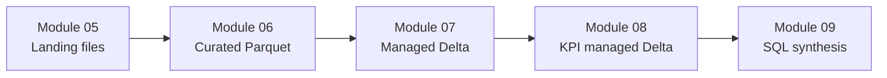

---
aliases:
  - Course Decisions
  - Decision Log
tags:
  - course/decisions
  - architecture
updated: 2026-08-12
---

# Course decisions

This note indexes decisions already established across the repository. It
summarizes and links; the canonical files remain authoritative.

## Source precedence

When documents disagree, use this order:

1. [COURSE_MODULES](../COURSE_MODULES.md) for module roadmap and status
2. The module `README.md` for lesson sequence, scope, outputs, and privileges
3. Approved BRDs and mappings for signed-off business contracts
4. [dataset overview](../docs/data/dataset-overview.md) for dataset schemas,
   keys, paths, and pipeline contracts
5. `docs/standards/` for repository-wide authoring policy
6. `docs/validation/` for author-recorded runtime evidence
7. Personal and temporary notes as context only

This precedence explains why Module 08 is considered current when
[COURSE_MODULES](../COURSE_MODULES.md) marks it Started, and why approved
Module 07 mappings override conflicting personal notes.

## D-001 — Course scope is batch data engineering

**Status:** Accepted

- Teach production-oriented batch data engineering.
- Exclude Structured Streaming, Auto Loader, streaming tables/pipelines,
  machine learning, and general Azure infrastructure administration.
- Assume basic Python and basic SQL, but no prior Spark, Databricks, or
  production data engineering experience.

Sources: [README](../README.md), [COURSE_MODULES](../COURSE_MODULES.md),
[AGENTS](../AGENTS.md)

## D-002 — Azure Databricks and Unity Catalog are the platform baseline

**Status:** Accepted

- Azure Databricks Premium with Unity Catalog enabled
- Databricks Runtime 17.3 LTS
- Spark 4.0.0
- Python 3.12
- Scala 2.13 runtime

Serverless uses independently versioned environments; the DBR pin must not be
claimed for serverless.

Sources: [README — Technical baseline](../README.md#technical-baseline),
[compute validation policy](../docs/standards/compute-validation-policy.md)

## D-003 — Learner notebooks use Databricks source `.py`

**Status:** Accepted

- Never use `.ipynb`.
- First line: `# Databricks notebook source`
- Cells use exact `# COMMAND ----------` boundaries.
- Markdown and SQL cells use Databricks `# MAGIC` markers.

Source: [notebook writing](../docs/standards/notebook-writing.md)

## D-004 — GitHub is the canonical remote source

**Status:** Accepted

```text
Cursor local authoring → GitHub → Azure Databricks Git folder
```

- Author and review locally.
- Push approved work to GitHub.
- Pull into an Azure Databricks Git folder.
- Execute Spark, Delta, and Unity Catalog behavior in Azure Databricks.

Local tooling handles formatting, linting, typing, and non-Spark tests only.

Sources: [README — Development workflow](../README.md#development-workflow),
[coding standards — Local tooling boundaries](../docs/standards/coding-standards.md#local-tooling-boundaries)

## D-005 — Documentation has explicit owners

**Status:** Accepted

| Artifact | Owns |
|---|---|
| [COURSE_MODULES](../COURSE_MODULES.md) | Roadmap, module purpose, prerequisites, production relevance, status |
| Module `README.md` | Detailed lesson design, navigation, outputs, minimum privileges |
| [dataset overview](../docs/data/dataset-overview.md) | Dataset schemas, join keys, physical paths, pipeline contracts |
| `docs/standards/` | Shared coding, notebook, teaching, naming, compute, and permission policy |
| `docs/validation/` | Author-recorded Azure runtime evidence |
| [AGENTS](../AGENTS.md) | Concise index pointing to canonical documents |

Cursor commands must not update roadmap status or runtime evidence
automatically.

## D-006 — One rideshare dataset threads through the course

**Status:** Accepted

The course uses `trip`, `trip_time`, `payment`, and `zone_lookup`, plus nested
`drivers`, instead of switching datasets between modules.

Core contracts:

- `trip`, `trip_time`, `payment`: 100 rows each
- `zone_lookup`: 22 rows
- `drivers`: 12 XML records
- Zones 21–22 are intentionally unmatched for outer-join teaching.

Canonical details: [dataset overview](../docs/data/dataset-overview.md)

## D-007 — The pipeline progresses from files to analytical outputs

**Status:** Accepted



- Module 05 writes practice outputs.
- Module 06 writes curated Parquet.
- Module 07 writes Unity Catalog managed Delta tables.
- Module 08 writes managed Delta `kpi_*` tables (`saveAsTable`).
- Modules after 05 do not read `practice/`.

Source: [dataset overview — Module pipeline](../docs/data/dataset-overview.md#module-pipeline)

## D-008 — `landing` and `processed` are UC schemas, not medallion layers

**Status:** Accepted

- Catalog: `rideshare_dev`
- Schemas: `landing`, `processed`
- Volumes: `landing.source_files`, `processed.output_files`
- `practice/` and `curated/` are folders inside the output volume.
- Formal Bronze/Silver/Gold architecture is taught in Module 12.

Source: [dataset overview — Unity Catalog platform reference](../docs/data/dataset-overview.md#unity-catalog-platform-reference)

## D-009 — Learner Azure resources vary; course UC names stay fixed

**Status:** Accepted

Each learner supplies their own storage account, container, storage credential,
and ADLS folder in the Module 05 setup and cleanup config cells. Course catalog,
schema, volume, table, and external-location names follow the canonical course
contract.

The storage credential must already exist; its creation instructions live in
course PDF material, not this repository.

Sources: [Module 05 README](../05%20-%20Reading,%20Writing,%20and%20Schemas/README.md),
[permissions and governance](../docs/standards/permissions-and-governance.md)

## D-010 — Permissions are three separate systems

**Status:** Accepted

Do not conflate:

1. Azure RBAC
2. Databricks workspace permissions
3. Unity Catalog privileges

Unity Catalog reads require the complete hierarchy:
`USE CATALOG → USE SCHEMA → object-level privilege`.

Source: [permissions and governance](../docs/standards/permissions-and-governance.md)

## D-011 — Compute validation starts on Standard all-purpose

**Status:** Accepted

1. Validate on classic all-purpose Standard access mode first.
2. Do not repeat on Dedicated after Standard passes unless the lesson or API
   requires it.
3. Use Dedicated for a verified technical or teaching reason, never to hide a
   defect.
4. Treat serverless as a compatibility check rather than the course default.
5. Test jobs or pipeline-managed compute only in modules that teach those
   systems.

Source: [compute validation policy](../docs/standards/compute-validation-policy.md)

## D-012 — Teaching starts concrete and progresses deliberately

**Status:** Accepted

- Explain unfamiliar ideas before use.
- Start with a concrete rideshare scenario.
- Show a worked example before assigning an exercise.
- Keep one concept path per notebook.
- Call out common production mistakes explicitly.
- Prefer depth on job-relevant APIs over broad API coverage.

Source: [teaching guidelines](../docs/standards/teaching-guidelines.md)

## D-013 — DataFrame API and built-ins are the default

**Status:** Accepted

- Import functions as `from pyspark.sql import functions as F`.
- Prefer built-in Spark functions over Python UDFs.
- Use readable chained transformations.
- Avoid `.collect()` and `.toPandas()` unless data is known to be small.
- Teach Spark SQL when it serves the lesson; Module 09 formalizes dual-API
  patterns.

Source: [coding standards](../docs/standards/coding-standards.md)

## D-014 — Explicit schemas and safe conversions are production defaults

**Status:** Accepted

- Schema inference is acceptable for small demonstrations, not the production
  default.
- Under Spark 4 ANSI behavior, prefer `try_cast` and related `try_*` functions
  to globally disabling ANSI mode.
- Normalize blanks, sentinels, and invalid values before drop/fill logic.
- Preserve rejected-row visibility through explicit checks.

Sources:
[Module 03 README](../03%20-%20Data%20Cleaning,%20NULL%20Semantics,%20and%20Type%20Handling/README.md),
[Module 05 README](../05%20-%20Reading,%20Writing,%20and%20Schemas/README.md)

## D-015 — Module 05 uses one primary source format per dataset

**Status:** Accepted

| Dataset | Primary teaching format |
|---|---|
| `trip` | CSV |
| `trip_time` | Parquet |
| `payment` | Avro |
| `zone_lookup` | JSON Lines |
| `drivers` | XML |

Alternate formats under `data/raw/` support authoring and comparison but are
not all copied to landing. The canonical `zone_lookup` source is the 22-row
JSON file; its 20-row Parquet alternate must not replace it in join lessons.

Sources: [Module 05 README](../05%20-%20Reading,%20Writing,%20and%20Schemas/README.md),
[dataset overview — Source files](../docs/data/dataset-overview.md#source-files)

## D-016 — Module 06 produces curated, cleaned contracts

**Status:** Accepted

- `curated/trip/`: 108 controlled-bad source rows become 106 rows.
- `curated/payment/`: 106 controlled-bad source rows become 105 rows.
- `curated/drivers_flat/`: one row per driver-trip assignment.
- `service_type` is uppercase.
- `payment_method` is lowercase.
- `UNKNOWN` and `unknown` are string sentinels, not SQL NULL.
- Derived enrichments remain in curated sources rather than automatically
  propagating to Module 07 targets.

Sources: [Module 06 README](../06%20-%20Built-in%20Functions,%20Complex%20Types,%20and%20UDF%20Alternatives/README.md),
[dataset overview — Module 6 curated outputs](../docs/data/dataset-overview.md#module-6--curated-outputs)

## D-017 — Module 07 joins preserve business grain and visible gaps

**Status:** Approved and runtime-verified on 2026-08-05

Two habits govern join lessons:

1. Know each input grain before joining.
2. Predict → run → verify.

For duplicates with different payloads, select deterministically with
`Window` and `row_number`; do not rely on arbitrary `dropDuplicates`.

Source: [Module 07 README](../07%20-%20Joins%20and%20Set%20Operations/README.md)

## D-018 — Module 07 delivers two lean managed tables

**Status:** Approved and signed off on 2026-08-05

### `trip_enriched`

- Grain: one row per `trip_id`
- 106 rows, 16 columns
- `curated/trip` drives left joins.
- Missing time and payment remain visible as NULL.
- Includes selected trip, time, core payment, and pickup/drop-off zone fields.
- Excludes operational timing, full payment breakdown, and derived curated
  enrichments.

### `trip_driver_assignment`

- Grain: one row per (`driver_id`, `trip_id`)
- 100 rows, 13 columns
- `drivers_flat` drives the result.
- Includes driver details and selected trip descriptors.
- Excludes time, payment, and zone-name fields.

The fuller production medallion design is deferred to Module 12.

Sources:
[BRD](../07%20-%20Joins%20and%20Set%20Operations/requirements/BRD.md),
[trip_enriched mapping](../07%20-%20Joins%20and%20Set%20Operations/requirements/trip_enriched_mapping.md),
[trip_driver_assignment mapping](../07%20-%20Joins%20and%20Set%20Operations/requirements/trip_driver_assignment_mapping.md)

## D-019 — Module 08 separates grouped and windowed grain

**Status:** Accepted module design; implementation in progress

- Name output grain before aggregation and verify it afterward.
- `groupBy` reduces rows.
- Windows preserve the rows they receive until a later filter.
- Use explicit `ROWS` frames for row-by-row running calculations.
- Top-N selection policy is explicit:
  - `row_number <= N` gives at most N rows per group.
  - `rank <= N` can retain extra tied rows.
- NULL sort placement must be intentional.

Source: [Module 08 README](../08%20-%20Aggregations%20and%20Window%20Functions/README.md)

## D-020 — Module 08 writes three managed Delta KPI tables

**Status:** Accepted; Notebook 08 authoring follows the approved md replica

- `rideshare_dev.processed.kpi_daily_trip_summary` — one row per non-NULL trip date (14)
- `rideshare_dev.processed.kpi_zone_performance` — one row per pickup borough and zone (20)
- `rideshare_dev.processed.kpi_driver_productivity` — one row per driver (12)
- Format: Unity Catalog managed Delta via `.mode("overwrite").saveAsTable(...)`
- Cleanup: Module 5 **99** Level 4 (not Level 2 `curated/`)

Column contracts live in the Module 8 README (Paths and outputs). Preferred
over Volume Parquet for Modules 9–13 (SQL/`spark.table`, Delta, Gold, MERGE).

Sources: [Module 08 README](../08%20-%20Aggregations%20and%20Window%20Functions/README.md),
[dataset overview — Module 8 KPI outputs](../docs/data/dataset-overview.md#module-8--kpi-outputs),
[08 - Build KPI Tables.md](../08%20-%20Aggregations%20and%20Window%20Functions/08%20-%20Build%20KPI%20Tables.md)

## Security and portability decisions

**Status:** Accepted

- Never commit tokens, passwords, client secrets, cluster IDs, or hardcoded
  local machine paths.
- Do not place personal catalog/schema names in public-facing content.
- Parameterize environment-specific values.
- Treat the repository as public.

Source: [coding standards — Security and portability](../docs/standards/coding-standards.md#security-and-portability)

> [!warning] Current inconsistency
> `databricks.yml` contains a committed workspace host even though repository
> standards prohibit committed workspace URLs. This requires a separate,
> deliberate configuration fix; this vault setup does not change it.

## Deferred and open decisions

- [x] Define Module 08 KPI column schemas in the Module 8 README (managed Delta tables).
- [ ] Decide whether Modules 07–08 need serverless compatibility evidence.
- [ ] Choose where to teach column- vs row-oriented files and warehouse vs
  lake vs lakehouse concepts from `take_notes/M5.txt`.
- [ ] Clarify Avro vs Parquet vs Delta positioning in future material.
- [ ] Introduce reusable `src/` package structure in Module 13 or later.
- [ ] Define the testing strategy in Module 17.
- [ ] Expand the Databricks bundle beyond its development stub in Module 15.

## Known documentation conflicts

- [Module 02 validation](../docs/validation/02%20-%20DataFrame%20Fundamentals.md)
  omits Notebook 05 despite the module being marked Complete.
- Module 07 personal notes ([[NB07_personal_notes]]) contain target columns
  that conflict with the approved mappings; the BRD and mapping documents
  prevail.

## Related

- [[home|Vault home]]
- [[progress|Course progress]]
- [COURSE_MODULES](../COURSE_MODULES.md) — canonical roadmap
