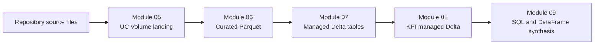
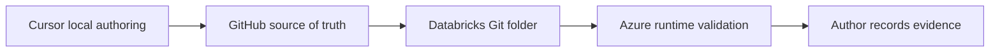

---
aliases:
  - Course Home
  - Vault Home
tags:
  - course/dashboard
  - pyspark
  - azure-databricks
---

# PySpark on Azure Databricks Academy

> [!info] Purpose
> A job-focused, batch-only PySpark data engineering course for Azure
> Databricks. This note is a navigation dashboard; canonical details remain in
> the linked project files.

## Start here

- [[progress|Course progress]] — roadmap, authored notebooks, validation, and
  current work
- [[decisions|Course decisions]] — accepted architecture, authoring, data, and
  pedagogy choices
- [COURSE_MODULES](../COURSE_MODULES.md) — canonical 19-module roadmap
- [README](../README.md) — learner-facing project overview
- [Rideshare dataset and pipeline contracts](../docs/data/dataset-overview.md)

## Current snapshot

- **Current module:** Module 09 — Spark SQL and DataFrame Interoperability
  (Not Started)
- **Roadmap state:** 8 complete, 0 started, 11 not started
- **Last completed:** [Module 08 — Aggregations and Window Functions](../08%20-%20Aggregations%20and%20Window%20Functions/README.md)
  — all 8 notebooks validated on classic all-purpose Standard
- **Next deliverable:** Module 09 module design / first lesson
- **Runtime baseline:** Databricks Runtime 17.3 LTS, Spark 4.0.0, Python 3.12
- **Source of truth for status:** [COURSE_MODULES](../COURSE_MODULES.md)

See [[progress#Current focus — Module 09]] for the detailed handoff.

## Course map

### Phase I — Language and engine foundations

- [01 — Azure Databricks and Spark Foundations](../01%20-%20Azure%20Databricks%20and%20Spark%20Foundations/README.md) — complete
- [02 — DataFrame Fundamentals](../02%20-%20DataFrame%20Fundamentals/README.md) — complete
- [03 — Data Cleaning, NULL Semantics, and Type Handling](../03%20-%20Data%20Cleaning,%20NULL%20Semantics,%20and%20Type%20Handling/README.md) — complete
- [04 — Transformations, Actions, and Lazy Evaluation](../04%20-%20Transformations,%20Actions,%20and%20Lazy%20Evaluation/README.md) — complete

### Phase II — Core data engineering

- [05 — Reading, Writing, and Schemas](../05%20-%20Reading,%20Writing,%20and%20Schemas/README.md) — complete
- [06 — Built-in Functions, Complex Types, and UDF Alternatives](../06%20-%20Built-in%20Functions,%20Complex%20Types,%20and%20UDF%20Alternatives/README.md) — complete
- [07 — Joins and Set Operations](../07%20-%20Joins%20and%20Set%20Operations/README.md) — complete
- [08 — Aggregations and Window Functions](../08%20-%20Aggregations%20and%20Window%20Functions/README.md) — complete
- Module 09 — Spark SQL and DataFrame Interoperability — not started

### Later phases

- **Phase III, Modules 10–12:** Delta Lake, Unity Catalog governance,
  medallion architecture
- **Phase IV, Modules 13–15:** reliable batch ingestion, Lakeflow Pipelines,
  jobs and deployment
- **Phase V, Modules 16–19:** performance, testing, observability, capstone

Use [COURSE_MODULES](../COURSE_MODULES.md) for scope, prerequisites, production
relevance, and author-owned status.

## Data journey

Core sources:

- `trip` — 100 rows, central fact
- `trip_time` — 100 rows, date/time extension
- `payment` — 100 rows, fare breakdown
- `zone_lookup` — 22 rows, location dimension
- `drivers` — 12 nested XML driver records

Important downstream contracts:

- `curated/trip/` — 106 rows
- `curated/payment/` — 105 rows
- `curated/drivers_flat/` — 100 driver-trip assignments
- `rideshare_dev.processed.trip_enriched` — 106 rows, 16 columns
- `rideshare_dev.processed.trip_driver_assignment` — 100 rows, 13 columns
- `rideshare_dev.processed.kpi_daily_trip_summary` — 14 rows
- `rideshare_dev.processed.kpi_zone_performance` — 20 rows
- `rideshare_dev.processed.kpi_driver_productivity` — 12 rows

Canonical schemas, keys, NULL contracts, and paths:
[dataset overview](../docs/data/dataset-overview.md).

## Authoring workflow

1. `/new-lesson` — create a notebook skeleton
2. `/write-lesson` — write the complete runnable lesson
3. `/validate-notebook` — perform an authoring-quality review
4. Run the notebook in Azure Databricks
5. The author records results under `docs/validation/`

Local `uv`, `ruff`, `mypy`, and `pytest` do not execute Spark. Spark, Delta,
and Unity Catalog behavior is validated only in Azure Databricks.

## Canonical references

### Standards

- [Notebook authoring checklist](../docs/standards/notebook-authoring-checklist.md)
- [Notebook writing](../docs/standards/notebook-writing.md)
- [Teaching guidelines](../docs/standards/teaching-guidelines.md)
- [Coding standards](../docs/standards/coding-standards.md)
- [Naming conventions](../docs/standards/naming-conventions.md)
- [Compute and validation policy](../docs/standards/compute-validation-policy.md)
- [Permissions and governance](../docs/standards/permissions-and-governance.md)

### Runtime evidence

- [Module 01](../docs/validation/01%20-%20Azure%20Databricks%20and%20Spark%20Foundations.md)
- [Module 02](../docs/validation/02%20-%20DataFrame%20Fundamentals.md)
- [Module 03](../docs/validation/03%20-%20Data%20Cleaning,%20NULL%20Semantics,%20and%20Type%20Handling.md)
- [Module 04](../docs/validation/04%20-%20Transformations,%20Actions,%20and%20Lazy%20Evaluation.md)
- [Module 05](../docs/validation/05%20-%20Reading,%20Writing,%20and%20Schemas.md)
- [Module 06](../docs/validation/06%20-%20Built-in%20Functions,%20Complex%20Types,%20and%20UDF%20Alternatives.md)
- [Module 07](../docs/validation/07%20-%20Joins%20and%20Set%20Operations.md)
- [Module 08](../docs/validation/08%20-%20Aggregations%20and%20Window%20Functions.md)

## Scope boundaries

The course covers production-oriented **batch data engineering** only.
Structured Streaming, Auto Loader, streaming tables, machine learning, and
general Azure infrastructure administration are outside the course scope.

## Vault maintenance

- Update [[progress]] after roadmap or validation changes.
- Add a dated entry to [[decisions]] when an architectural or pedagogical
  choice is approved.
- Do not treat these notes as replacements for canonical roadmap, standards,
  dataset, module README, or validation files.
