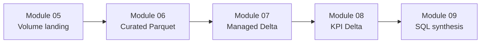
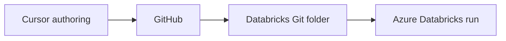

---
aliases:
  - Course Home
  - Vault Home
tags:
  - course/dashboard
  - pyspark
  - azure-databricks
---

# PySpark on Azure Databricks Academy

> [!info] Purpose
> Author navigation dashboard. Status, schemas, and lesson design stay in
> the linked canonical files — not duplicated here.

## Navigate

| Note / file | Use it for |
|---|---|
| [[progress]] | Where the course stands today |
| [[decisions]] | Why the course is shaped this way |
| [COURSE_MODULES](../COURSE_MODULES.md) | Full roadmap, prerequisites, module status |
| [README](../README.md) | Learner-facing overview |
| [Dataset overview](../docs/data/dataset-overview.md) | Schemas, keys, paths, pipeline contracts |

## Current snapshot

See [[progress#At a glance]] for counts and [[progress#Current focus]] for the
active module.

| | |
|---|---|
| **Working on** | Module 11 — Delta Lake Transactions, Schema, and Maintenance |
| **Last completed** | [Module 10 — Delta Lake Foundations](../10%20-%20Delta%20Lake%20Foundations/README.md) |
| **Roadmap** | 10 complete · 11 not started (Modules 11–21) |
| **Runtime baseline** | Databricks Runtime 17.3 LTS · Spark 4.0.0 · Python 3.12 |
| **Status authority** | [COURSE_MODULES](../COURSE_MODULES.md) |

## Course phases

Full module tables and status live in [COURSE_MODULES](../COURSE_MODULES.md).

| Phase | Modules | State |
|---|---:|---|
| I — Language and engine foundations | 01–04 | Complete |
| II — Core data engineering | 05–09 | Complete |
| III — Lakehouse design and implementation | 10–14 | 10 complete; next 11 |
| IV — Reliable batch pipelines | 15–16 | Not started |
| V — Quality, delivery, and operations | 17–21 | Not started |

## Teaching pipeline (Modules 05–09)

Module 10 teaches Delta foundations on isolated lab objects — it does not
mutate the teaching tables above. Row counts, column contracts, and paths:
[dataset overview](../docs/data/dataset-overview.md).

## Authoring workflow

1. `/write-module-readme` or `/new-lesson` → `/write-lesson` → `/validate-notebook`
2. `/review-module` when every notebook in the module is ready
3. Run notebooks in Azure Databricks
4. Update [[progress]] and [COURSE_MODULES](../COURSE_MODULES.md) when status changes

Local `uv`, `ruff`, and `mypy` do not execute Spark. Spark, Delta, and Unity
Catalog behavior is validated only in Azure Databricks.

## Quick links

- [Notebook authoring checklist](../docs/standards/notebook-authoring-checklist.md)
- [Notebook writing](../docs/standards/notebook-writing.md)
- [Teaching guidelines](../docs/standards/teaching-guidelines.md)
- [Coding standards](../docs/standards/coding-standards.md)
- [Naming conventions](../docs/standards/naming-conventions.md)
- [Compute validation policy](../docs/standards/compute-validation-policy.md)
- [Permissions and governance](../docs/standards/permissions-and-governance.md)

## Scope

Batch data engineering only. Structured Streaming, Auto Loader, streaming
tables, machine learning, and general Azure infrastructure administration are
out of scope.

## Maintaining this vault

- Update [[progress]] after roadmap or module-completion changes.
- Add entries to [[decisions]] when an architectural or pedagogical choice is
  approved — not for routine module completion.
- Do not duplicate canonical files here.
